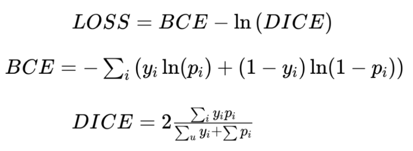

# Brain Tumor MRI Segmentation by using UNet - PyTorch 

## Introduction

Image Segmentation is widely implemented in every industries. 
For examples, from manufacturing industries until medical industries. 
Absolutely by utilizing this technology, Industries can increase their productivity. 
Especially, in medical industry, it can easily diagnose patient's disease. 
Not only that, it can be developed also to diagnose automatically. 

In this project, 
i try to implement UNet model from scratch for segmenting Brain Tumor MRI image.


## Dataset

Dataset that i use for this project, i take from kaggle. If anyone want to try it, 
you can visit this dataset [Brain Tumor MRI Dataset](https://www.kaggle.com/datasets/mateuszbuda/lgg-mri-segmentation).
The dataset contains 110 images of brain MRI  with their corresponding segmentation masks. Both of images and masks size 
i use for are 128px x 128px. Then, i split the data into training and testing data by using split size (test size) 0.2.


## Model
```

# unet.py
import torch.nn as nn
from modulars.model_parts import DoubleConv, DownSampling, UpSampling

class UNet(nn.Module):
    def __init__(self, input_shape: int=3, output_shape: int=1):
        super(UNet, self).__init__()
        self.enc1 = DownSampling(input_shape, 64)
        self.enc2 = DownSampling(64, 128)
        self.enc3 = DownSampling(128, 256)
        self.enc4 = DownSampling(256, 512)

        self.bottleneck = DoubleConv(512, 1024)

        self.dec4 = UpSampling(1024, 512)
        self.dec3 = UpSampling(512, 256)
        self.dec2 = UpSampling(256, 128)
        self.dec1 = UpSampling(128, 64)

        self.out = nn.Conv2d(64, output_shape, 1)

    def forward(self, x):
        down1, pool1 = self.enc1(x)
        down2, pool2 = self.enc2(pool1)
        down3, pool3 = self.enc3(pool2)
        down4, pool4 = self.enc4(pool3)

        bottleneck = self.bottleneck(pool4)

        dec4 = self.dec4(bottleneck, down4)
        dec3 = self.dec3(dec4, down3)
        dec2 = self.dec2(dec3, down2)
        dec1 = self.dec1(dec2, down1)

        out = self.out(dec1)
        return out
```

The UNet model is trained for 30 epochs, with batch size of 4. The model also trained on Nvidia GTX 1050.

## Metric and Loss

Metric function for this project is Dice Coefficient and 
loss function is BCE Dice Loss (combination of Binary Cross Entropy Loss and Dice Loss)



## Results

### Model's performance result


### Prediction results
After training for 30 epochs, this model got 66% dice loss on test data and got 50% dice metric on test data.
